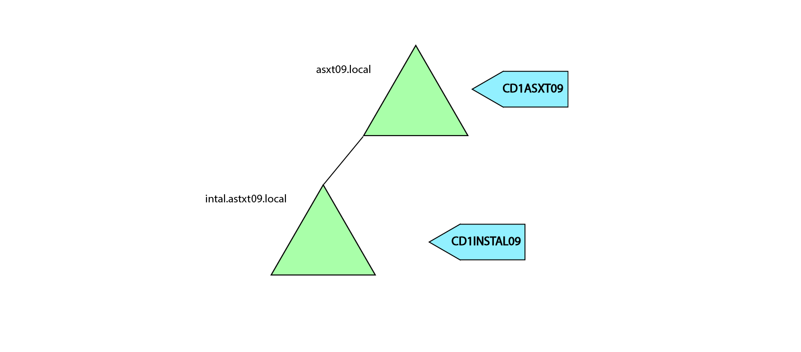
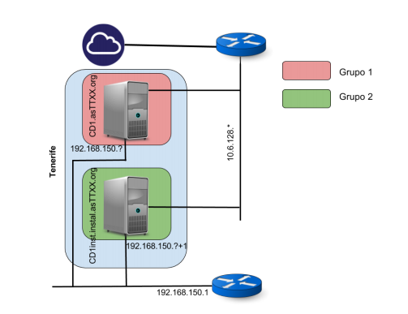
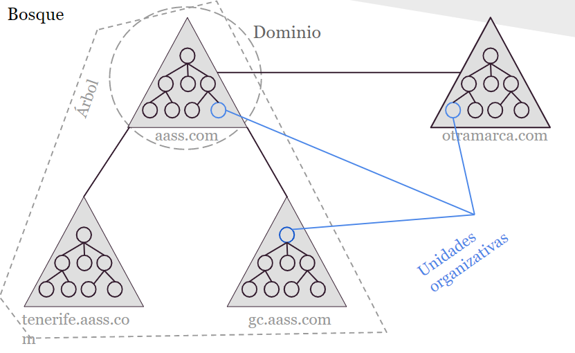

# ADMINISTRACIÓN DE SISTEMAS | PRÁCTICA 3

**Gestión de usuarios y recusros en Windows 2012 - Dominio Raíz**

> Por: Éric Dürr Sierra ( [alu0101027005](alu0101027005@ull.edu.es) )

El siguiente documento pretende **recopilar todo el proceso** llevado a cabo para el desarrollo
de la práctica del bloque de administración de sistemas en **Windows**. Concretamente se expone el desarrollo del servidor raíz **( CD1ASXT09 | astxt09.local )**.

Se detallarán más en 
profundidad aquellos aspectos que sean pertinentes al volumen teórico de la asignatura al igual 
que se resumirán aquellos aspectos más secundarios o que puedan resultar obvios.

 
 
 
 
 
 

***

**Índice**

1. [Introducción](#id1)
2. [Situación de la organización](#id2) 
3. [Diseño de la estructura de la organización](#id3)
4. [Desarrollo de los requisitos de la organización](#id4)
    - [Administración de las directivas](#id4_1)
    - [Administración de los empleados](#id4_2)
    - [Administración de los grupos](#id4_3)  
    - [Administración de los prtoyectos](#id4_4)
    - [Administración de los recursos](#id4_5)

5. [Script de automatización de nuevos usuarios (parte opcional)](#id5)
6. [Problemas encontrados](#id6)
7. [Conclusión](#id7)
8. [Bibliografía y referencias](#id8)

***

 
 
 
 
 
 
 
 
 
 
 
 
 
 
 
 

## 1. Introducción

Principalmente se abordará la creación de un entorno basado en Windows 2012 que deberá soportar un número determinado de usuarios, grupos globales, grupos locales y directorios a fin de organizar cuatro proyectos. dos de ellos hospedados en el dominio raíz y los otros dos sencillamente considerados a través de los grupos globales, ya que se encuentran en otro dominio.

Los proyectos que residen en este dominio (el raíz) son el de Auditorio y el de Aeropuerto, además de los cinco de diez empleados ( 1, 2, 3, 7, 8) que participarán y dirigirán los mismos.

Algunas palabras claves con las que vincular este proyecto son:

+ Directorio Activo
> Son los términos que utiliza Microsoft para referirse a su implementación de servicio de directorio en una red distribuida de computadores. Utiliza distintos protocolos, principalmente LDAP, DNS, DHCP y Kerberos.

+ Windows Server
> Es el nombre corporativo de una serie de sistemas operativos de servidor producidos por Microsoft

+ Administrador del servidor
> Es una consola de administración en Windows Server que permite provisionar y manipular remota y localmente las funcionalidades y recursos del Directorio Activo

+ DNS (Domain Name System)
>es un sistema de nomenclatura jerárquico descentralizado para dispositivos conectados a redes IP como Internet o una red privada.

+ DHCP (Dynamic Host Configuration Protocol)
>Es un protocolo que permite que un equipo conectado a una red pueda obtener su configuración en forma dinámica. Sólo habrá que especificarle al equipo, mediante DHCP, que encuentre una dirección IP de manera independiente.

+ Directivas 
> Con ellas podemos administrar virtualmente todo en los sistemas de nuestro entorno, desde el fondo del escritorio hasta qué aplicaciones pueden ejecutarse. Incluyendo no sólo los escritorios cliente sino también los servidores.

+ Dominio
>Un dominio de Active Directory es un contenedor lógico utilizado para administrar usuarios, grupos y computadoras entre otros objetos.

+ Bosque
> En Active Directory el bosque (forest) es una colección de uno o más dominios  que comparten una misma estructura lógica, catálogo global, esquema y configuración.

+ Árbol
>Un árbol de dominios (tree) es una colección de uno o más dominios que comparten un espacio de nombre contiguo. Por ejemplo si el primer dominio se llama contoso.com y tiene un subdominio, este sería subdominio.contoso.com.

+ Grupo global
>Se usan los grupos con ámbito Global para administrar objetos de directorio que requieran un 
mantenimiento diario, como las cuentas de usuario y de equipo. Dado que los grupos con ámbito 
Global no se replican fuera de su propio dominio, las cuentas de un grupo con ámbito Global se 
pueden cambiar frecuentemente sin generar tráfico de replicación en el catálogo global.

+ Grupo local
>Los grupos con ámbito Local de dominio ayudan a definir y administrar el acceso a los recursos dentro de un dominio único. 
>
>Su visivilidad se restringe al dominio donde han sido definidos.

 
 

## 2. Situación de la organización

Nuestra organización va a disponer de diez empleados para llevar a cabo cuatro proyectos. Estos proyectos se encuentran divididos entre dos dominios. Cada dominio se encargará de administrar dos proyectos y cinco de los usuarios. Sin embargo los empleados y directores participan en múltiples proyectos ubicados en ambos dominios. 
> Empleados: Emple1, Emple2, Emple3, Emple4, Emple5, Emple6, Emple7, Emple8, Emple9 y Emple10. 

> Proyectos: Auditorio, Aeropuerto, Centro comercial y Parque.

Estos empleados también estarán sujetos a unos horarios y obligaciones que deberán administrarse correctamente para llevar a cabo los requisitos de la organización.

Sus roles se ven representados en la siguiente tabla:

 

En la tabla se muestra la divisón de responsabilidades de los empleados en ambos dominios. Cada elemento se establece como:
- R: Dominio Raíz.
- I: Dominio de instalaciones.
- Direc: Director del proyecto.
- Particip: Participante del proyecto.

Cuando se establezcan los permisos estos roles supondrán la forma de establecer los permisos en base a la jurisdicción de cada tipo de empleado.

También nuestra organización está **sujeta a** una serie de **requisitos** divididos en los distintos ámbitos **( contraseñas, cirectorio privado, proyectos, directores e información compartida )** que se nos establecen een el enunciado. 

 
 

## 3. Diseño de la estructura de la organización

Esta práctica se ha desarrollado de forma paralela en dos dominios alojados en diferentes máquinas virtuales, de modo que cada alumno (que ejerce el rol de adminitsrador) deba encargarse individualmente de configurar y gestionar sus recursos para que los empleados puedan operar sin impedimentos en cada uno de 
los proyectos.

Uno de los dos dominios debe ser la raíz, donde se aloja la base de la organización (que es en el que se centra este informe), el cual denominamos bajo el DN "*dc=asxt09,dc=local*" (asxt09.local).
> La elaboración del nombre del dominio se compone por:
>> as (Administración de Sistemas)
>
>> XX (Día y turno, en este caso miércoles tarde)
>
>> YY (Número del grupo, en este caso el 9)
>
>> .local (La segunda componente del DN)    

El otro dominio, es el de instalaciones, cuyo DN es similar pero con la extensión de subdominio *instal* (instal.asxt09.local). Este será hijo del dominio raíz. La siguiente imagen ilustra este bosque.

Que el dominio de instalaciones sea hijo del Raíz no implica que el padre administre ambos. Cada dominio deberá administrarse de manera independiente siendo las jurisdicciones de responsabilidad de los recursos locales a cada uno de ellos.

También se debe distinguir la estructura por sedes, cada una con su raíz, con sus máquinas y sus Administradores. En este caso la de Tenerife, en el dominio raíz hablamos del controlador de dominio *CD1ASXT09*.

 

Como se aprecia en la imagen cada controlador del dominio dispondrá de dos interfaces de red para conectarse; una de ellas interna *192.168.150.---* y otra externa *10.6.128.---*. La interna se empleará para comunicar los controladores
dentro del bosque, mientras que la externa será empleada para conectarse a la red.

Cabe destacar que no se debe confundir el bosque con sus unidades organizativas, las cuales son internas a cada dominio. La siguiente imagen ilustra este concepto:

**Resumen:**

Nuestro dominio será asxt09.local, bajo el controlador CD1ASXT09, dentro del bosque de la sede de Tenerife. A su vez nuestro dominio contiene la Unidad Organizativa (OU) *Practica_3* donde distinguiremos otras dos OU, *grupos* y *empleados* que contendrán cada una de las entradas de usuarios y grupos respectivamente que iremos creando.

 
 

## 4. Desarrollo de los requisitos de la organización

    En este apartado se expondrán los distintos aspectos de la administración del sistema de la organización en base
    a los requuisitos exigidos por la misma. En este apartado se parte desde el punto en que la instalación y configuración
    del dominio ha sido realizada según los documentos proporcionados y el Directorio Activo es completamente funcional. 
    Además de que se ha preparado la máquina para estar conectada por medio de las dos interfaces de red, interna y externa, a la 
    máquina del dominio de instalaciones y a internet respectivamente.

 

### 4.1. Administración de las directivas

 

### 4.2. Administración de los empleados

 

### 4.3. Administración de los grupos 

 

### 4.4. Administración de los proyectos

 

### 4.5. Administración de los recursos

 
 

## 5. Script de automatización de nuevos usuarios (parte opcional)

 
 

## 6. Problemas encontrados

 
 

## 7. Conclusión

 
 

## 8. Bibliografía y referencias

- [Documentio de instalación AD-IAAS](https://docs.google.com/document/d/15JZq7p0MvTtbSuf2MSbrIWJU1r4rQ4hbt6SVHWZztfA/edit#heading=h.gjdgxs)
- [Documento de instalación de Máquina windows en el IAAS](https://docs.google.com/document/d/1a5MTotTzvvbbTr_sxEkYUZFSHWXny6aEAc_uIWfCs3E/edit)
- [Manual de Active Directory](https://activedirectoryenwindows.blogspot.com/)
- [Documentación de Windows 10 y Windows Server 2016 para PowerShell](https://docs.microsoft.com/en-us/powershell/windows/get-started?view=win10-ps)
- [Grupos de Active Directory | Windows Server 2012](https://administracionsistemasoperativos201415.wordpress.com/2015/02/25/grupos-de-active-directory-grupos-predefinidos/)
- [Conceptos de Active Directory | Exchange](https://aprendiendoexchange.com/conceptos-active-directory)
- [Tutorial de creación de usuarios en AD mediante PowerShell](https://blog.netwrix.com/2018/06/07/how-to-create-new-active-directory-users-with-powershell/)
- [Uso de CVS en PowerShell | Documentación de Microsoft](https://docs.microsoft.com/en-us/powershell/module/microsoft.powershell.utility/import-csv?view=powershell-7)