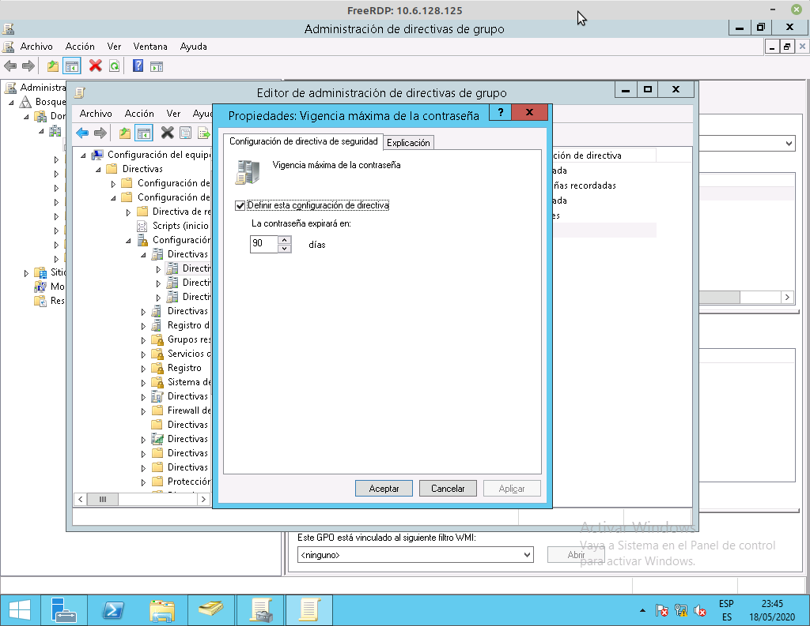
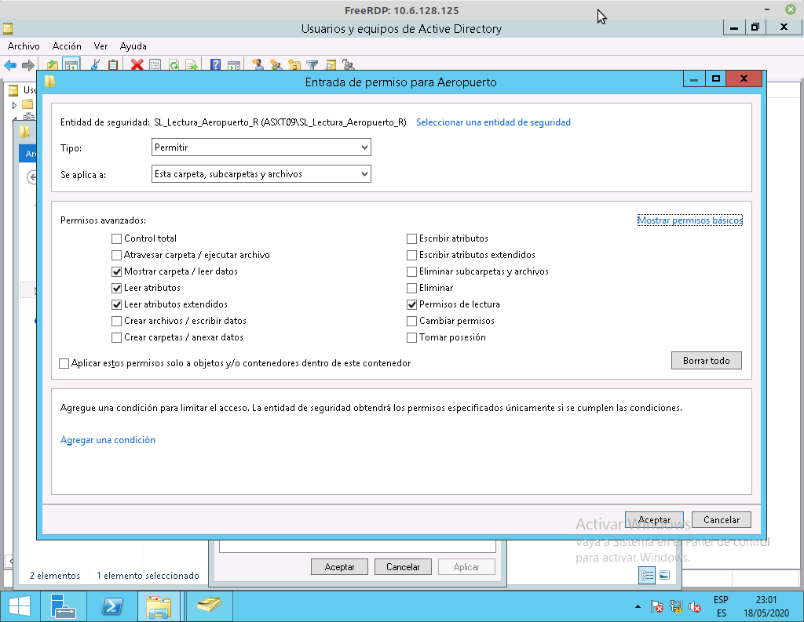
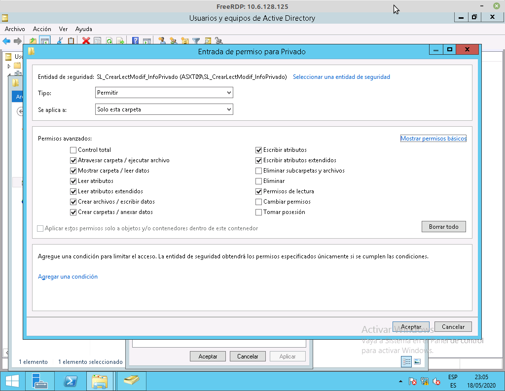

# ADMINISTRACIÓN DE SISTEMAS | PRÁCTICA 3

**Gestión de usuarios y recusros en Windows 2012 - Dominio Raíz**


> Por: Éric Dürr Sierra ( [alu0101027005](alu0101027005@ull.edu.es) )


El siguiente documento pretende **recopilar todo el proceso** llevado a cabo para el desarrollo
de la práctica del bloque de administración de sistemas en **Windows**. Concretamente se expone el desarrollo del servidor raíz **( CD1ASXT09 | astxt09.local )**.

Se detallarán más en 
profundidad aquellos aspectos que sean pertinentes al volumen teórico de la asignatura al igual 
que se resumirán aquellos aspectos más secundarios o que puedan resultar obvios.

<br>
<br>
<br>
<br>
<br>
<br>

***

## **Índice**

## 1. [Introducción](#id1) · · · · · · · · · · · · · · · · · · · · · · · · · · · · · · · · · · · · · · · · · · · · · · · · · · 
## 2. [Situación de la organización](#id2) · · · · · · · · · · · · · · · · · · · · · · · · · · · · · · · · · · · · 
## 3. [Diseño de la estructura de la organización](#id3)  · · · · · · · · · · · · · · · · · · · · · · · 
## 4. [Desarrollo de los requisitos de la organización](#id4) · · · · · · · · · · · · · · · · · · ·
-  ### [Administración de las directivas](#sub1)
-  ### [Administración de los empleados](#sub2)
-  ### [Administración de los grupos](#sub3)  
-  ### [Administración de los prtoyectos](#sub4)
-  ### [Administración de los recursos compartidos](#sub5)
## 
## 5. [Script de automatización de nuevos usuarios (parte opcional)](#id5) · · · · ·
## 6. [Bibliografía y referencias](#id6) · · · · · · · · · · · · · · · · · · · · · · · · · · · · · · · · · · · · · · · 

***


<br>
<br>
<br>
<br>
<br>
<br>
<br>
<br>
<br>
<br>
<br>
<br>
<br>
<br>
<br>
<br>
<div id="id1"\>

## 1. Introducción

Principalmente se abordará la creación de un entorno basado en Windows 2012 que deberá soportar un número determinado de usuarios, grupos globales, grupos locales y directorios a fin de organizar cuatro proyectos. dos de ellos hospedados en el dominio raíz y los otros dos sencillamente considerados a través de los grupos globales, ya que se encuentran en otro dominio.

Los proyectos que residen en este dominio (el raíz) son el de Auditorio y el de Aeropuerto, además de los cinco de diez empleados ( 1, 2, 3, 7, 8) que participarán y dirigirán los mismos.

Algunas palabras claves con las que vincular este proyecto son:

+ Directorio Activo
> Son los términos que utiliza Microsoft para referirse a su implementación de servicio de directorio en una red distribuida de computadores. Utiliza distintos protocolos, principalmente LDAP, DNS, DHCP y Kerberos.

+ Windows Server
> Es el nombre corporativo de una serie de sistemas operativos de servidor producidos por Microsoft


+ Administrador del servidor
> Es una consola de administración en Windows Server que permite provisionar y manipular remota y localmente las funcionalidades y recursos del Directorio Activo

+ DNS (Domain Name System)
>es un sistema de nomenclatura jerárquico descentralizado para dispositivos conectados a redes IP como Internet o una red privada.

+ DHCP (Dynamic Host Configuration Protocol)
>Es un protocolo que permite que un equipo conectado a una red pueda obtener su configuración en forma dinámica. Sólo habrá que especificarle al equipo, mediante DHCP, que encuentre una dirección IP de manera independiente.

+ Directivas 
> Con ellas podemos administrar virtualmente todo en los sistemas de nuestro entorno, desde el fondo del escritorio hasta qué aplicaciones pueden ejecutarse. Incluyendo no sólo los escritorios cliente sino también los servidores.


+ Dominio
>Un dominio de Active Directory es un contenedor lógico utilizado para administrar usuarios, grupos y computadoras entre otros objetos.

+ Bosque
> En Active Directory el bosque (forest) es una colección de uno o más dominios  que comparten una misma estructura lógica, catálogo global, esquema y configuración.

+ Árbol
>Un árbol de dominios (tree) es una colección de uno o más dominios que comparten un espacio de nombre contiguo. Por ejemplo si el primer dominio se llama contoso.com y tiene un subdominio, este sería subdominio.contoso.com.


+ Grupo global
>Se usan los grupos con ámbito Global para administrar objetos de directorio que requieran un 
mantenimiento diario, como las cuentas de usuario y de equipo. Dado que los grupos con ámbito 
Global no se replican fuera de su propio dominio, las cuentas de un grupo con ámbito Global se 
pueden cambiar frecuentemente sin generar tráfico de replicación en el catálogo global.

+ Grupo local
>Los grupos con ámbito Local de dominio ayudan a definir y administrar el acceso a los recursos dentro de un dominio único. 
>
>Su visivilidad se restringe al dominio donde han sido definidos.


<br>
<br>
<div id="id2"\>

## 2. Situación de la organización

Nuestra organización va a disponer de diez empleados para llevar a cabo cuatro proyectos. Estos proyectos se encuentran divididos entre dos dominios. Cada dominio se encargará de administrar dos proyectos y cinco de los usuarios. Sin embargo los empleados y directores participan en múltiples proyectos ubicados en ambos dominios. 
> Empleados: Emple1, Emple2, Emple3, Emple4, Emple5, Emple6, Emple7, Emple8, Emple9 y Emple10. 

> Proyectos: Auditorio, Aeropuerto, Centro comercial y Parque.

Estos empleados también estarán sujetos a unos horarios y obligaciones que deberán administrarse correctamente para llevar a cabo los requisitos de la organización.

Sus roles se ven representados en la siguiente tabla:

<div style="display: flex; justify-content: center;">

</div> 

En la tabla se muestra la divisón de responsabilidades de los empleados en ambos dominios. Cada elemento se establece como:
- R: Dominio Raíz.
- I: Dominio de instalaciones.
- Direc: Director del proyecto.
- Particip: Participante del proyecto.

Cuando se establezcan los permisos estos roles supondrán la forma de establecer los permisos en base a la jurisdicción de cada tipo de empleado.

También nuestra organización está **sujeta a** una serie de **requisitos** divididos en los distintos ámbitos **( contraseñas, cirectorio privado, proyectos, directores e información compartida )** que se nos establecen een el enunciado. 


<br>
<br>
<div id="id3"\>

## 3. Diseño de la estructura de la organización

Esta práctica se ha desarrollado de forma paralela en dos dominios alojados en diferentes máquinas virtuales, de modo que cada alumno (que ejerce el rol de adminitsrador) deba encargarse individualmente de configurar y gestionar sus recursos para que los empleados puedan operar sin impedimentos en cada uno de 
los proyectos.

Uno de los dos dominios debe ser la raíz, donde se aloja la base de la organización (que es en el que se centra este informe), el cual denominamos bajo el DN "*dc=asxt09,dc=local*" (asxt09.local).
> La elaboración del nombre del dominio se compone por:
>> as (Administración de Sistemas)
>
>> XX (Día y turno, en este caso miércoles tarde)
>
>> YY (Número del grupo, en este caso el 9)
>
>> .local (La segunda componente del DN)    

El otro dominio, es el de instalaciones, cuyo DN es similar pero con la extensión de subdominio *instal* (instal.asxt09.local). Este será hijo del dominio raíz. La siguiente imagen ilustra este bosque.


Que el dominio de instalaciones sea hijo del Raíz no implica que el padre administre ambos. Cada dominio deberá administrarse de manera independiente siendo las jurisdicciones de responsabilidad de los recursos locales a cada uno de ellos.

También se debe distinguir la estructura por sedes, cada una con su raíz, con sus máquinas y sus Administradores. En este caso la de Tenerife, en el dominio raíz hablamos del controlador de dominio *CD1ASXT09*.

<div style="display: flex; justify-content: center;">

</div> 

Como se aprecia en la imagen cada controlador del dominio dispondrá de dos interfaces de red para conectarse; una de ellas interna *192.168.150.---* y otra externa *10.6.128.---*. La interna se empleará para comunicar los controladores
dentro del bosque, mientras que la externa será empleada para conectarse a la red.

Cabe destacar que no se debe confundir el bosque con sus unidades organizativas, las cuales son internas a cada dominio. La siguiente imagen ilustra este concepto:


**Resumen:**

Nuestro dominio será asxt09.local, bajo el controlador CD1ASXT09, dentro del bosque de la sede de Tenerife. A su vez nuestro dominio contiene la Unidad Organizativa (OU) *Practica_3* donde distinguiremos otras dos OU, *grupos* y *empleados* que contendrán cada una de las entradas de usuarios y grupos respectivamente que iremos creando.

<br>
<br>
<div id="id4"\>


## 4. Desarrollo de los requisitos de la organización

    En este apartado se expondrán los distintos aspectos de la administración del sistema 
    de la organización en basea los requisitos exigidos por la misma. Se parte desde el 
    punto en que la instalación y configuración del dominio ha sido realizada según los 
    documentos proporcionados y el Directorio Activo es completamente funcional.
     
    Además de que se ha preparado la máquina para estar conectada por medio de las dos interfaces 
    de red, interna y externa, a la máquina del dominio de instalaciones y a internet respectivamente.

<br>

<div id="sub1"\>

### 4.1. Administración de las directivas
<br>
Las directivas en Active Directory nos permiten establecer unas normas para configurar múltiples 
aspectos sobre el dominio. En este caso se manipularán directivas especialmente relacionadas con 
la configuración de seguridad y accesibilidad del dominio por parte de
los usuarios del mismo. Cabe destacar que hay numerosas directivas para propósitos muy variados, 
pero se hablarán de las empleadas.

En primera instancia se van a preparar las directivas pertinentes a las contraseñas de los 
usuarios que creemos en el dominio con el fin de cumplir algunos de los requisitos impuestos por 
la organización. Ocuparemos en este apartado los siguientes:

1. Los usuarios deben cambiar de contraseña cada 3 meses.
2. Los usuarios no pueden cambiar las contraseñas hasta 2 semanas despues de haberla cambiado.
3. No se permiten contraseñas en blanco. Deben tener una longitud mínima de 4 caracteres.
4. La nueva contraseña no puede coincidir con las dos últimas introducidas por el usuario
5. Si se producen 4 intentos fallidos de autenticación en el mismo intervalo de 10 minutos se debe bloquear permanentemente la cuenta.

Para manipular estas directivas debemos abrir la herramienta de *Administración de direcitas de grupo* presente el panel del *Administrador del servidor*. El siguiente paso es acceder a las directivas que necesitamos, para ello debemos localizarnos en:

> **Dominios** &#8594; **asxt09.local** &#8594; **Default Domain Policy**

Una vez localizado este archivo debemos editarlo dando *click derecho* y  pulsando  *editar*. En la ventana emergente el siguiente paso es situarnos en:

>**Configuración del equipo** &#8594; **Directivas** &#8594; **Configuración de Windows** &#8594;   **Configuración de seguridad** &#8594; **Directivas de cuenta** &#8594; **Directivas de contraseña**


Una vez en esta localización el siguente paso es configurar los atributos de la directiva en base a los requisitos. Empleando la ventana de propiedades de cada uno podremos establecer :


- El histroial de contraseñas con el valor 2 para recordarlas y satisfacer así el requisito 4.


- Longitud mínima de la contraseña con valor de 4 caracteres para staisfacer el tercer requisito.


- Vigencia máxima de la contraseña con valor 90 días para satisfacer el primer requisito 



- Vigencia mínima de la contraseña con valor de 14 días para cumplir el requisito 2


<br>
Para cumplir un último requisito a los usuarios se les asignará como contraseña su propio nombre de usuario.


<br>

Otras directivas que debemos manipular con las de asignación de derechos de usuario para que estos se puedan conectar desde el escritorio remoto y para permitir el acceso local. Esto también se encuentra detallado en el documento que antecede a la práctica, pero en un resumen global se deben manipular los atributos antes mencionados en la directiva de *Asignación de derechos de usuario* añadiendo a los grupos que queremos que accedan, en nuestro caso un grupo que contenga a los empleados del dominio. Se accede a esta directiva a través de:

>**Configuración del equipo** &#8594; **Directivas** &#8594; **Configuración de Windows** &#8594;   **Configuración de seguridad** &#8594; **Directivas locales** &#8594; **Asignación de derechos de usuario**

<br>

<div id="sub2"\>

### 4.2. Administración de los empleados
<br>

Se van a crear 5 empleados, cada uno de ellos dispondrá de un directorio privado. Se explicará como se lleva a cabo este proceso de manera manual, pero en el [apartado 5](#id5) de este informe se expone el script que permite automatizar el proceso.

Para llevar a cabo la creración de los usuarios debemos emplear la herramienta de Usuarios y equipos de Active Directory, la cual se encuentra trambién en el Administrador del servidor. 

En la ventana de dicha herramienta se nos presentan las distintas entradas de nuestro dominio. Desde aquí podremos crear grupos y usuarios además de unidades organizativas y otras opciones que no conciernen a este apartado.

El primer paso es crear una unidad organizativa con:

>**Click derecho sobre el dominio** &#8594; **Nuevo** &#8594; **Unidad Organizativa**

Aquí crearemos otras dos con el mismo procedimiento para albergar en una los usuarios y en otra los grupos (esto mantendrá las cosas más ordenadas). Es dentro de la unidad organizativa de empleados donde debemos crear los usuarios seleccionando su opción en la barra de opciones superior o con:

>**Click derecho sobre el Empleados** &#8594; **Nuevo** &#8594; **Usuario**

Una vez ejecutemos esa opción debemos introducir los parámetros en la ventana emergente para crear el usuario. Se introducirá un nombre de pila y un nombre de inicio de sesión y en el siguiente apartado una contraseña desmarcando la opción de cambiarla en el siguiente inicio de sesión.

Este proceso se debe repetir para los 5 empleados del dominio bajo la unidad organizativa Empleados y debería quedar algo similar a esto:


En cuanto a las propiedades de cada usuario debemos atender a 3 de sus campos especialmente:

- Cuenta: para administrar sus horarios y la fecha de expiración.
- Perfil: para indicar el script de inicio de sesión y su carpeta particular.
- Miembro de: para administrar los grupos a los que pertenece el usuario.

El primer campo que vamos a revisar va a ser el de *Cuenta* para hacer cumplir los siguientes requisitos impuestos por la orgaqnización:

- Los empleados del turno de mañana (1,2 y 3 en este dominio) acceden de 08:00 a 15:00 
- Los empleados del turno de tarde (7 y 8 en este dominio) acceden de 14:00 a 21:00
- Los empleados 1 y 3 del dominio se contratan temporalmente por 6 meses  

Así pues, en esta pestaña se debe acceder al apartado de *Horas de inicio de sesión* e introducir las franjas correspondientes mediante la herramienta interactriva quedando de la siguiente manera para los empleados 1, 2 y 3:


y así para los empleados 7 y 8:


Por último se debe modificar para 1 y 3 la expiración de la cuenta marcando *Fin de:* e introduciendo la fecha de expiración (6 meses desde la creación en nuestro caso).

<br>
Por otro lado en la pestaña perfil podremos modificar algunos campos que nos servirán en un futuro para compartir recursos al usuario. Aquí indicaremos el nombre del inicio de sesión y su carpeta particular marcando *Conectar:* e indicando el nombre del reecurso compartido así como la unidad donde se va a montar.

Debería quedar como en la imagen siguiente:


Por otro lado para la creación de los directorios de cada usuario vamos a crear carpetas en *C:/home*, siendo *home* una carpeta creada por nosotros. Se debe crear una por empleado y acto seguido modificar sus propiedades para que solo su propietario y el administrador tengan acceso a ella. De esta manera, por cada directorio personal vamos a modificar los permisos dentro de la ventana de propiedades.

Para modificar los permisos debemos acceder a la pestaña de *Seguridad* donde podremos modificar quien tiene acceso al recurso. Debemos *editar* los permisos y en la ventana emergente agregar al usuario pertinente y eliminar los grupos o usuarios que no nos sean de interés (todos menos el Administrador, los Administradores y el usuario en cuestión). La siguiente imagen ilustra como debería quedar:


Una vez hecho esto queda modificar los permisos para que este usuario tenga control total dentro de su directorio excluyendo la eliminación del mismo o la modificación de sus permisos. A esto accedemos mediante el botón de *Opciones avanzadas* de la pestaña *Seguridad*. En la ventana emergente debemos seleccionar al empleado y *Editar* sus permisos avanzados. Deben quedar seleccionados, solo para este directorio, tal y como muestra la imagen:


Tras esto solo quedaría compartir el recurso, pero eso se detalla en una sección futura.

<br>

<div id="sub3"\>

### 4.3. Administración de los grupos 
<br>

De cara a poder asignar permisos a los usuarios en calidad de ejercer distintos roles (*participante o director*) en cada uno de los proyectos se deben crear grupos globales que encapsulen bajo dichos roles a los empleados de cada proyecto de cara a que estos puedan ser accesibles por el dominio de instalaciones. Además se deben crear grupos de caracter local que tendrán la funcionalidad de recopilar los grupos globales de cada uno dee los proyectos y proporcionar permisos a los empleados de una manera más controlada.

El siguiente esquema ilustra esta estructura:


Los grupos se van a crear siguiendo el mismo proceso empleado en el apartado anterior con los usuarios pero creando grupos y bajo la Unidad Organizativa Grupos. En este caso debemos atender al ámbito que pertenecen (*global* *local*), que sean de seguridad y que cumplan una nomenclatura que permia identificar su tipo
(*SG* o *SL*), su rol (*Participantes* o *Directores*) ,su proyecto si lo requiere (*Aeropuerto*) y su dominio (*R* o *I*). de esta manera un posible nombre es **SG_ParticipantesAeropuerto_R** indicando que es un grupo de Seguridad Global para los 
Participantes del proyecto Aeropuerto del dominio Raíz.  En el caso de los grupos locales se añade a la nomenclatura los permisos que proporciona estar en ese grupo.

Aquí se puede apreciar como debería quedar la Unidad Organizativa tras añadir todos los grupos de los proyectos:


Una vez hecho esto podrémos asignar los miembros de cada grupo en base a la tabla de la [sección 3 del informe](#id3) mediante la pestaña de miembros en las propiedades de cada grupo.
En los grupos globales se añadirán los empleados correspondientes y en los  grupos locales los grupos globales a los que se les asignará el permiso que atañe al rol que describe el grupo, para luego administrar su acceso en el directorio de cada proyecto.

<br>

<div id="sub4"\>

### 4.4. Administración de los proyectos
<br>

Los proyectos van a tener cada uno un directorio donde se manipulará toda la información por los empleados. Cada uno de los directorios va a "colgar" de un dirctorio *Proyectos* que se encuentra en *C:/*. En este caso como estamos en el dominio raíz se crearán los directorios de *Auditorio* y *Aeropuerto*. Las operaciones que se van a realizar en este apartado corresponden mayoritariamente a los permisos de cada rol.

En primer lugar, para los directores de cada proyecto se deben administrar, en las propiedades del directorio (tal y como se ha hecho para los directorios personales), los permisos.  En este caso debemos añadir los grupos locales de control total (**SL_CtrlTotal_[proyecto]_R**) a cada proyecto de manera que los directores tengan todos los permisos posibles para la creación de carpetas y ficheros, su modificación y su borrado. De esta manera accederemos nuevamente las propiedades del directorio para administrar los permisos en la pestaña de *Seguridad* es aquí donde debemos cuidar de que solo estén incluidos los grupos de seguridad local y los administradores. Siendo esto así procedemos a cambiar los permisos en la ventana de *Configuración de seguridad avanzada* la misma que se ha usado anteriormente.

Se deben establecer los permisos para esta y sus subcarpetas tal y como muestra la imagen:


Para los directores que no supervisan un proyecto deben tener permisos de lectura en el resto, por ello añadiremos también el grupo local para los permisos de solo lectura (**SL_Lectura_[proyecto]_R**), siguiendo el mismo procedimiento antes mencionado pero con los permisos avanzados tal y como los muestra la siguiente imagen:




<br>

También habrán grupos locales para administrar los permisos de los empleados participantes  de los proyectos de manera que estos puedan solo leer y modificar archivos que ya hayan sido creados por los directores de cada proyecto. Para facilitar la gestión de estos permisos se crearán dos grupos locales uno para los permisos de solo lectura (**SL_LecturaParticipantes_[proyecto]_R**) y otro para la modificación de archivos (**SL_ModificarArchivos_[proyecto]_R**).

El grupo local que corresponde a los permisos de lectura debe tener los permisos del directorio tal y como se muestra en la siguiente imagen:


Y de la siguiente manera para el de los permisos de modificación:


Cabe destacar en este último que solo se han provisto de los permisos de control total (salvo eliminar y cambiar permisos) en los archivos del directorio permitiendo así solamente escribir datos y anexar datos, lo que lleva a la modificación de archivos ya existentes.
<br>

Por último se solicita que en el dominio raíz haya un directorio común que cuelga de la carpeta *Info* al que denominaremos *Privado*. A este directorio común solo van a poder acceder los directores de la organización.

El primer paso es crear el directorio *Info* y dentro de este el directorio *Privado*
al cual le modificaremos las propiedades de seguirdad para añadir de forma exclusiva los grupos globales de los directores de todos los proyectos de ambos dominios; eliminando además aquellos grupos que no correspondan a funciones del sistema o Administradores.

a estos grupos globales se les asigna control total aplicado a solo este directorio, salvo la eliminación y el cambio de permisos del directorio claro está. Nuevamente todo esto se hace dentro de la configuración avanzada empleada hasta ahora y con los permisos avanzados.

Debería quedar acorde a la siguiente imagen una vez realizada la modificación:



<br>
<div id="sub5"\>

### 4.5. Administración de los recursos compartidos
<br>

Dado que cada usuario debe poder acceder automáticamente a los proyectos y a su directorio a través de las unidades montadas en el equipo se deben compartir todos los recursos que se pretendan hacer accesibles por esta vía.

Comenzando por el directorio personal se puede tomar una visión general de lo que hay que hacer con todos los directorios ( o ficheros) que se quieran compartir. Para ello hay que acceder a la ventana de propiedades del directorio personal y abrir la pestaña *Compartir*


Una vez ahí lo que sigue es abrir el *Uso compartido avanzado* y proporcionarle un nombre


Tras esto debemos acceder a la ventana de *Permisos* y ahí eliminar el grupo *Todos* para despues añadir al usuario al que pretendemos compartirlo. Debemos asignar los permisos de *Control total*, sin embargo luego se aplicarán los permisos más restrictivos que hayamos asigando en el directorio al usuario.


Lo único que restaría es, en las propiedades del usuario, introducir el nombre del recurso compartido para el acceso a la carpeta particular.

Este proceso se hace de manera similar para el resto de recursos variando los grupos o usuarios a los que se comparte y su nombre.


Para el uso automático a través de las unidades p:, q: ... de los proyectos se podría emplear el comando

```bat
net use [unidad]: \\CD1ASXT09.astx09.local\nombre\de\recurso
```

Sin embargo será más eficiente disponer de un script de inicio de sesión que ejecute esto automáticamente para cada usuario. El script sería de la siguiente manera si queremos compartir los proyectos:

```bat
::Proyectos
net use p: \\CD1ASXT09.astx09.local\Auditorio
net use q: \\CD1ASXT09.astx09.local\Aeropuerto
net use r: \\CD1INSTALASXT09.instal.astx09.local\Parque
net use s: \\CD1INSTALASXT09.instal.astx09.local\CentroComercial

::Directorios comunes
net use t: \\CD1ASXT09.astx09.local\Privado
net use v: \\CD1INSTALASXT09.instal.astx09.local\Publico

```

Debemos guardar el script en *C:\Windows\SYSVOL\Sysvol\asxt09.local\scripts* para que lo podamos incluir únicamente con el nombre en la ventana de propiedades de cada usuario, en la pestaña de *Perfil* en el apartado *script de inicio de sesión*


<br>
<br>
<div id="id5"\>

## 5. Script de automatización de nuevos usuarios (parte opcional)

Como tarea opcional se ha escogido programar un script de PowerShell que automatice la creación de nuevos usuarios por medio de la lecutra de un fichero CSV. Un fichero CSV  no es más que un formato de texto que separa los elementos por un *token* que se emplea para parsear la primera fila a modo array de tipos de variable y las siguientes filas como valores contenidos en cada uno de esos tipos. de modo que de una tabla se puede extraer una estructura que manipularemos con programación


A continuación se expone paso a paso como funciona


El primer paso es inicializar algunas variables globales que vamos a necesitar como son el *Distinguished Name* de la Unidad Organizativa donde vamos a meter al usuario, la ruta a la carpeta contenedora de los CSV y la instancia de los usuarios a crear em el CSV. Para este último se  emplea la sentencia en PowerShell *Import-Csv* la cual nos lee y formatea el csv de la ruta que se le indica a continuación

```ps

#Distinguished Name bajo el que se situará al usuario (En este caso los empleados de Práctica 3)
$path = "OU=Empleados,OU=Practica_3,DC=asxt09,DC=local"

#Ruta de los csv
$csvPath = "C:\Windows\SYSVOL\sysvol\asxt09.local\scripts"

#Importamos las entradas del fichero CSV
$USERS = Import-Csv $csvPath\users.csv 

```

Una vez almacenado el contenido del CSV tenemos todos los datosnecesarios para crear un usuario. Sencillamente debemos iterar con un *foreach* que toma de manera implícita el número de entidades y nos permite iterar sus elementos. Dentro del bucle lo que debemos hacer es tomar todas las variables que vamos a emplear y a continuación comprobar si el usuario existe, de ser así se pasa al siguente apartado


```ps

#Este proceso se repite por cada una de las entradas
foreach ($USER in $USERS)
{

    #Almacenamos en variables los valores de cada entrada
    $NAME = $USER.Name
    $PASS = $USER.Pass
    $GFILE = $USER.GroupFile

    #Comprobamos la existencia del usuario antes de crearlo (Enviando un mensaje de aviso de ser así)
    if (Get-ADUser -F {SamAccountName -eq $NAME})
    {
        Write-Warning "El empleado $NAME ya existe en el proyecto"
    }
    else
    {

```

Una vez pasado el filtro se ejecuta *New-ADUser* (Nuevo usuario de Active Directory) pasándole como argumento todas las propiedades que pretendemos configurar:
- Nombre
- Nombre de usuario
- Contraseña (esta debe convertirse a un *Secure String*)
- La OU en la que se encuentra
- Si el usuario está activado
- No cambiar la contraseña en el inicio de sesión
- El script de inicio de sesión

```ps
    #Se crea el usuario con los argumentos adecuados para insertarlo en el sistema
        New-ADUser 
        -Name $NAME 
        -GivenName $NAME 
        -SamAccountName $NAME 
        -AccountPassword (ConvertTo-SecureString $PASS -AsPlainText -Force) 
        -Path $path 
        -Enabled $true 
        -ChangePasswordAtLogon $false 
        -ScriptPath "mapping.bat"
```

El último paso del script es introducir los grupos globales a los que pertenece el usuario. Esto se hace mediante otro csv contenido en este, para ello debemos hacer que una de las columnas sea el nombre del CSV que contiene sus grupos. Estos se leerán como se ha hecho con el usuario y se asignarán empleando la sentencia *Add-ADGroupMember*. Cabe destacar que el CSV debe estar en la misma ubicación que el de los usuarios y que deben introducirse grupos ya existentes que a la fuerza sean globales.

```ps
    #Para cada usuario importamos el CSV que contiene la lista de grupos globales del usuario
        $GROUPS = Import-Csv $csvPath\$GFILE


    #Por cada una de las entradas de los grupos asignamos a cada usuario a su lista correspondiente 
        foreach($GROUP in $GROUPS)
        {
            $GNAME = $GROUP.GlobalGroup
            Add-ADGroupMember 
            -Identity $GNAME 
            -Members $NAME
        }
     }

```


<br>
<br>
<div id="id6"\>

## 6. Bibliografía y referencias

- [Documentio de instalación AD-IAAS](https://docs.google.com/document/d/15JZq7p0MvTtbSuf2MSbrIWJU1r4rQ4hbt6SVHWZztfA/edit#heading=h.gjdgxs)
- [Documento de instalación de Máquina windows en el IAAS](https://docs.google.com/document/d/1a5MTotTzvvbbTr_sxEkYUZFSHWXny6aEAc_uIWfCs3E/edit)
- [Manual de Active Directory](https://activedirectoryenwindows.blogspot.com/)
- [Documentación de Windows 10 y Windows Server 2016 para PowerShell](https://docs.microsoft.com/en-us/powershell/windows/get-started?view=win10-ps)
- [Grupos de Active Directory | Windows Server 2012](https://administracionsistemasoperativos201415.wordpress.com/2015/02/25/grupos-de-active-directory-grupos-predefinidos/)
- [Conceptos de Active Directory | Exchange](https://aprendiendoexchange.com/conceptos-active-directory)
- [Tutorial de creación de usuarios en AD mediante PowerShell](https://blog.netwrix.com/2018/06/07/how-to-create-new-active-directory-users-with-powershell/)
- [Uso de CVS en PowerShell | Documentación de Microsoft](https://docs.microsoft.com/en-us/powershell/module/microsoft.powershell.utility/import-csv?view=powershell-7)